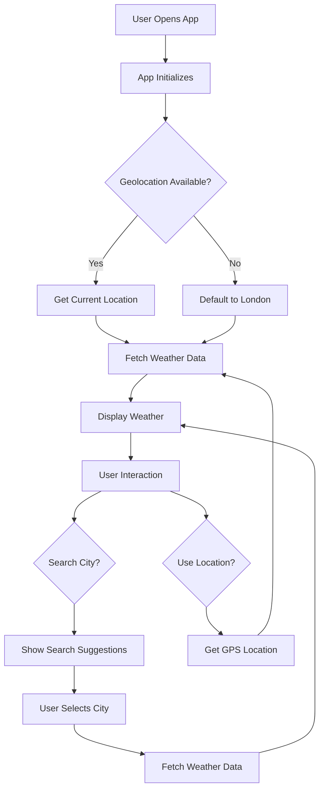
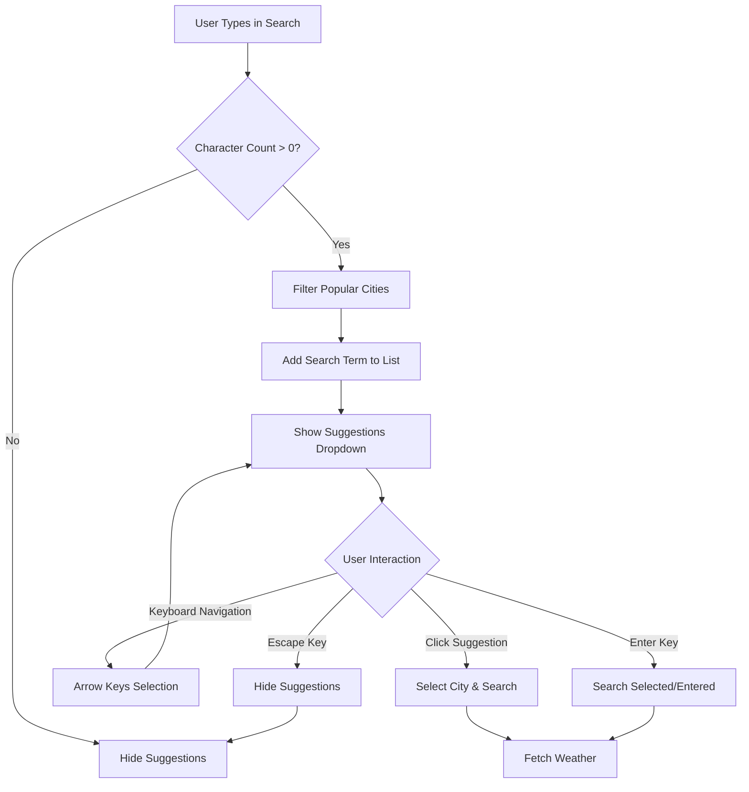
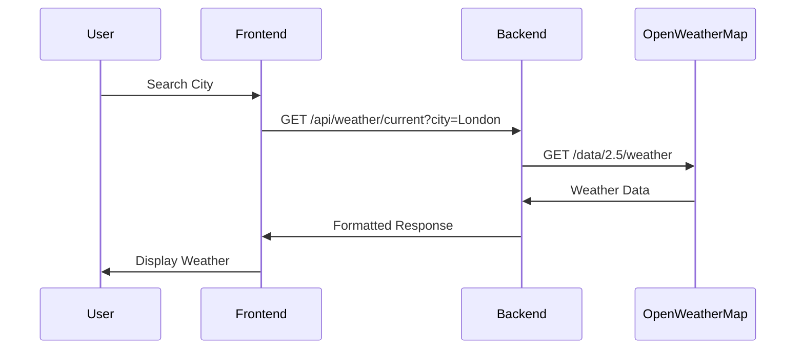
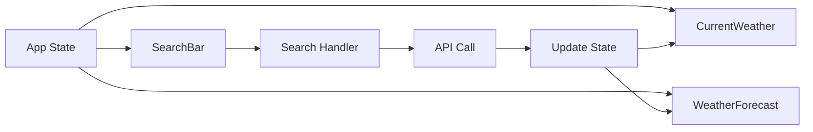
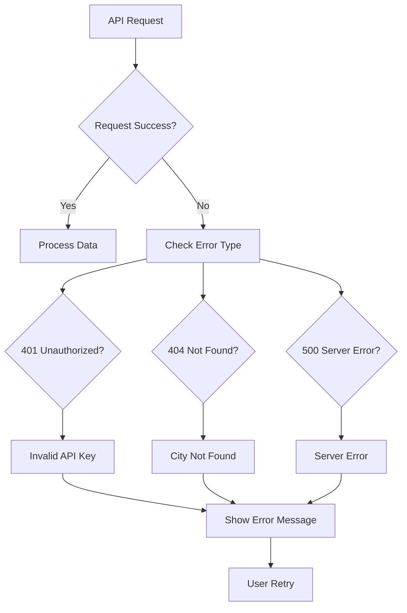

# 🌤️ WeatherNow

Your day, your weather, your way. A modern, responsive weather application built with the MERN stack (MongoDB, Express.js, React.js, Node.js) that provides real-time weather data and forecasts for cities worldwide.


## 📋 Table of Contents

- [Features](#-features)
- [Tech Stack](#-tech-stack)
- [Architecture Overview](#-architecture-overview)
- [Project Structure](#-project-structure)
- [Installation & Setup](#-installation--setup)
- [Environment Configuration](#-environment-configuration)
- [API Documentation](#-api-documentation)
- [Frontend Components](#-frontend-components)
- [Backend Services](#-backend-services)
- [Database Schema](#-database-schema)
- [Flow Charts & Diagrams](#-flow-charts--diagrams)
- [Usage Guide](#-usage-guide)
- [Deployment](#-deployment)
- [Testing](#-testing)
- [Contributing](#-contributing)
- [License](#-license)

## ✨ Features

### 🌟 Core Features
- **Real-time Weather Data**: Current weather conditions for any city worldwide
- **5-Day Forecast**: Extended weather predictions with detailed metrics
- **Geolocation Support**: Automatic location detection using browser GPS
- **Smart Search with Suggestions**: Intelligent city search with real-time suggestions
- **Responsive Design**: Mobile-first approach with modern UI/UX

### 🎨 UI/UX Features
- **Glassmorphism Design**: Modern glass-like interface elements
- **Smart Search Dropdown**: Real-time city suggestions as you type
- **Smooth Animations**: CSS animations and transitions
- **Dark/Light Theme**: Adaptive color schemes
- **Interactive Elements**: Hover effects and micro-interactions
- **Accessibility**: Screen reader support and keyboard navigation

### 🔧 Technical Features
- **RESTful API**: Clean, documented API endpoints
- **Smart Search Algorithm**: Intelligent city filtering and suggestions
- **Error Handling**: Comprehensive error management
- **Rate Limiting**: API request optimization
- **Caching**: Response caching for better performance
- **Security**: Helmet.js security headers

## 🛠️ Tech Stack

### Frontend
- **React.js 18.2.0**: Modern React with hooks and functional components
- **CSS3**: Advanced CSS with custom properties and animations
- **Lucide React**: Beautiful, customizable icons
- **Responsive Design**: Mobile-first CSS Grid and Flexbox

### Backend
- **Node.js 18.0.0**: JavaScript runtime environment
- **Express.js 4.18.2**: Fast, unopinionated web framework
- **Axios**: HTTP client for API requests
- **Helmet**: Security middleware
- **CORS**: Cross-origin resource sharing
- **Compression**: Response compression middleware

### Development Tools
- **Nodemon**: Auto-restart server during development
- **ESLint**: Code quality and consistency
- **Prettier**: Code formatting
- **Git**: Version control

## 🏗️ Architecture Overview

```
┌─────────────────┐    ┌─────────────────┐    ┌─────────────────┐
│   Frontend      │    │   Backend       │    │   External      │
│   (React)       │◄──►│   (Node.js)     │◄──►│   APIs          │
│                 │    │   (Express)      │    │                 │
└─────────────────┘    └─────────────────┘    └─────────────────┘
         │                       │                       │
         │                       │                       │
         ▼                       ▼                       ▼
┌─────────────────┐    ┌─────────────────┐    ┌─────────────────┐
│   Browser       │    │   Middleware    │    │ OpenWeatherMap  │
│   Storage       │    │   Stack         │    │ API             │
│   (LocalStorage)│    │   (CORS, Auth) │    │ (Weather Data)  │
└─────────────────┘    └─────────────────┘    └─────────────────┘
```

## 📁 Project Structure

```
weather-application/
├── 📁 client/                          # React Frontend
│   ├── 📁 public/                      # Static files
│   │   ├── index.html                  # Main HTML file
│   │   ├── manifest.json               # PWA manifest
│   │   └── favicon.ico                 # App icon
│   ├── 📁 src/                         # Source code
│   │   ├── 📁 components/              # React components
│   │   │   ├── SearchBar.js            # Search functionality with suggestions
│   │   │   ├── CurrentWeather.js       # Current weather display
│   │   │   ├── WeatherForecast.js      # Forecast display
│   │   │   ├── LoadingSpinner.js       # Loading states
│   │   │   └── ErrorMessage.js         # Error handling
│   │   ├── App.js                      # Main app component
│   │   ├── index.js                    # React entry point
│   │   └── 📁 styles/                  # CSS files
│   ├── package.json                    # Frontend dependencies
│   └── README.md                       # Frontend documentation
├── 📁 server/                          # Node.js Backend
│   ├── server.js                       # Express server setup
│   ├── routes/                         # API route handlers
│   ├── middleware/                     # Custom middleware
│   ├── services/                       # Business logic
│   └── utils/                          # Utility functions
├── package.json                        # Backend dependencies
├── .env.example                        # Environment variables template
├── .gitignore                          # Git ignore rules
├── start.bat                           # Windows startup script
├── start.sh                            # Unix startup script
└── README.md                           # Project documentation
```

## 🚀 Installation & Setup

### Prerequisites
- **Node.js**: Version 18.0.0 or higher
- **npm**: Version 8.0.0 or higher
- **Git**: For version control
- **OpenWeatherMap API Key**: Free account required

### Quick Start

1. **Clone the repository**
   ```bash
   git clone <repository-url>
   cd weather-application
   ```

2. **Install dependencies**
   ```bash
   # Install backend dependencies
   npm install
   
   # Install frontend dependencies
   cd client
   npm install
   cd ..
   ```

3. **Environment setup**
   ```bash
   # Copy environment template
   cp .env.example .env
   
   # Edit .env file with your API key
   OPENWEATHER_API_KEY=your_api_key_here
   PORT=5000
   NODE_ENV=development
   ```

4. **Start the application**
   ```bash
   # Start backend server (Terminal 1)
   npm run dev
   
   # Start frontend (Terminal 2)
   npm run client
   ```

### Alternative Startup Scripts

**Windows (start.bat)**
```batch
@echo off
echo Installing dependencies...
npm install
cd client && npm install && cd ..
echo Starting servers...
start "Backend" npm run dev
timeout /t 3
start "Frontend" npm run client
```

**Unix/Linux (start.sh)**
```bash
#!/bin/bash
echo "Installing dependencies..."
npm install
cd client && npm install && cd ..
echo "Starting servers..."
npm run dev &
sleep 3
npm run client &
```

## ⚙️ Environment Configuration

### Required Environment Variables

```env
# OpenWeatherMap API Configuration
OPENWEATHER_API_KEY=your_api_key_here

# Server Configuration
PORT=5000
NODE_ENV=development

# Optional: Database Configuration (if using MongoDB)
MONGODB_URI=mongodb://localhost:27017/weather-app

# Optional: Security
JWT_SECRET=your_jwt_secret_here
CORS_ORIGIN=http://localhost:3000
```

### Getting OpenWeatherMap API Key

1. Visit [OpenWeatherMap](https://openweathermap.org/api)
2. Sign up for a free account
3. Navigate to "My API Keys"
4. Copy your API key
5. Add it to your `.env` file

## 📡 API Documentation

### Base URL
```
http://localhost:5000/api
```

### Endpoints

#### 1. Current Weather
```http
GET /api/weather/current
```

**Query Parameters:**
- `city` (string): City name (e.g., "London")
- `lat` (number): Latitude coordinate
- `lon` (number): Longitude coordinate

**Example Request:**
```bash
curl "http://localhost:5000/api/weather/current?city=London"
```

**Response:**
```json
{
  "city": "London",
  "country": "GB",
  "temperature": 18.5,
  "feels_like": 17.2,
  "description": "scattered clouds",
  "icon": "03d",
  "humidity": 65,
  "wind_speed": 4.12,
  "wind_direction": 280,
  "pressure": 1013,
  "sunrise": "06:45 AM",
  "sunset": "07:30 PM",
  "timestamp": "2024-01-15T10:30:00Z"
}
```

#### 2. Weather Forecast
```http
GET /api/weather/forecast
```

**Query Parameters:**
- `city` (string): City name
- `lat` (number): Latitude coordinate
- `lon` (number): Longitude coordinate

**Response:**
```json
[
  {
    "date": "2024-01-16",
    "temp_min": 12.5,
    "temp_max": 20.1,
    "description": "light rain",
    "icon": "10d",
    "humidity": 78,
    "wind_speed": 3.2
  }
]
```

#### 3. Health Check
```http
GET /api/health
```

**Response:**
```json
{
  "status": "OK",
  "timestamp": "2024-01-15T10:30:00Z"
}
```

## 🎨 Frontend Components

### Component Architecture

```
App.js
├── SearchBar
│   ├── SearchInput
│   ├── SearchSuggestions
│   ├── SearchButton
│   └── LocationButton
├── CurrentWeather
│   ├── WeatherHeader
│   ├── WeatherIcon
│   ├── TemperatureDisplay
│   └── WeatherDetails
├── WeatherForecast
│   ├── ForecastHeader
│   └── ForecastCards
├── LoadingSpinner
└── ErrorMessage
```

### Component Details

#### 1. SearchBar Component
- **Purpose**: City search and location detection with smart suggestions
- **Features**: 
  - **Smart Search Suggestions**: Real-time city suggestions as you type
  - **Popular Cities List**: Pre-loaded list of 30+ major cities worldwide
  - **Keyboard Navigation**: Arrow keys, Enter, and Escape support
  - **Glassmorphism Design**: Modern glass-like interface elements
  - **GPS Location Detection**: Automatic location detection
  - **Responsive Layout**: Mobile-first design

#### 2. CurrentWeather Component
- **Purpose**: Display current weather information
- **Features**:
  - Large weather icon
  - Temperature display
  - Detailed metrics grid
  - Responsive card layout

#### 3. WeatherForecast Component
- **Purpose**: Show 5-day weather forecast
- **Features**:
  - Horizontal scrollable cards
  - Daily weather summaries
  - Temperature ranges
  - Weather conditions

## 🔧 Backend Services

### Service Architecture

```
Server.js
├── Middleware Stack
│   ├── Helmet (Security)
│   ├── Compression (Performance)
│   ├── CORS (Cross-origin)
│   └── JSON Parser
├── Route Handlers
│   ├── Weather Routes
│   ├── Health Check
│   └── Static Files
└── Error Handling
    ├── API Errors
    ├── Validation Errors
    └── Server Errors
```

### Middleware Stack

1. **Helmet**: Security headers
2. **Compression**: Response compression
3. **CORS**: Cross-origin resource sharing
4. **JSON Parser**: Request body parsing
5. **Static Files**: Serve React build

### Error Handling

```javascript
// Global error handler
app.use((err, req, res, next) => {
  console.error(err.stack);
  res.status(500).json({
    error: 'Something went wrong!',
    message: err.message
  });
});
```

## 🗄️ Database Schema

### Weather Data Model (Future Implementation)

```javascript
// MongoDB Schema (planned)
const WeatherData = {
  city: String,
  country: String,
  coordinates: {
    lat: Number,
    lon: Number
  },
  current: {
    temperature: Number,
    feels_like: Number,
    description: String,
    icon: String,
    humidity: Number,
    wind_speed: Number,
    wind_direction: Number,
    pressure: Number,
    sunrise: String,
    sunset: String,
    timestamp: Date
  },
  forecast: [{
    date: Date,
    temp_min: Number,
    temp_max: Number,
    description: String,
    icon: String,
    humidity: Number,
    wind_speed: Number
  }],
  last_updated: Date
};
```

## 📊 Flow Charts & Diagrams

### 1. Application Flow



### 2. Smart Search Flow



### 3. API Request Flow



### 4. Component Data Flow



### 5. Error Handling Flow



## 📱 Usage Guide

### Basic Usage

1. **Open the application** in your browser
2. **Allow location access** for automatic weather detection
3. **Search for a city** using the smart search bar
4. **View suggestions** as you type (30+ popular cities)
5. **Select from suggestions** or type your own city
6. **View current weather** and 5-day forecast
7. **Use location button** to get weather for your current position

### Smart Search Features

- **Real-time Suggestions**: Type to see city suggestions instantly
- **Popular Cities**: Quick access to major cities worldwide
- **Keyboard Navigation**: 
  - **↑/↓ Arrow Keys**: Navigate through suggestions
  - **Enter**: Select highlighted suggestion or search entered text
  - **Escape**: Close suggestions dropdown
- **Click Navigation**: Click any suggestion to instantly search
- **Auto-complete**: Smart filtering of city names

### Advanced Features

- **Keyboard Navigation**: Use Tab and Enter keys
- **Responsive Design**: Works on all device sizes
- **Offline Support**: Caches recent weather data
- **Accessibility**: Screen reader compatible

### Troubleshooting

| Issue | Solution |
|-------|----------|
| Weather not loading | Check API key in .env file |
| Location not working | Allow browser location access |
| Search not working | Check internet connection |
| App not responsive | Clear browser cache |
| Suggestions not showing | Ensure you're typing in the search box |

## 🚀 Deployment

### Production Build

```bash
# Build frontend
cd client
npm run build
cd ..

# Start production server
npm start
```

### Environment Variables for Production

```env
NODE_ENV=production
PORT=5000
OPENWEATHER_API_KEY=your_production_api_key
```

### Deployment Platforms

- **Heroku**: Easy deployment with Git integration
- **Vercel**: Frontend deployment
- **Railway**: Full-stack deployment
- **DigitalOcean**: Custom server deployment

## 🧪 Testing

### Frontend Testing

```bash
cd client
npm test
```

### Backend Testing

```bash
npm test
```

### Manual Testing Checklist

- [ ] Search functionality with suggestions
- [ ] Keyboard navigation in suggestions
- [ ] Location detection
- [ ] Weather display
- [ ] Forecast display
- [ ] Error handling
- [ ] Responsive design
- [ ] Accessibility features

## 🤝 Contributing

### Development Setup

1. Fork the repository
2. Create a feature branch
3. Make your changes
4. Add tests if applicable
5. Submit a pull request

### Code Style

- Use ES6+ features
- Follow React best practices
- Maintain consistent formatting
- Add JSDoc comments
- Write meaningful commit messages

### Pull Request Guidelines

- Clear description of changes
- Screenshots for UI changes
- Test coverage for new features
- Update documentation if needed

## 📄 License

This project is licensed under the MIT License - see the [LICENSE](LICENSE) file for details.

## 🙏 Acknowledgments

- **OpenWeatherMap**: For providing weather data API
- **React Team**: For the amazing React framework
- **Express.js**: For the robust backend framework
- **Lucide**: For beautiful icons
- **CSS Community**: For modern CSS techniques

## 📞 Support

- **Issues**: [GitHub Issues](https://github.com/your-repo/issues)
- **Discussions**: [GitHub Discussions](https://github.com/your-repo/discussions)
- **Email**: your-email@example.com

## 🔄 Changelog

### Version 1.0.0 (Current)
- Initial release
- Basic weather functionality
- **NEW: Smart search with real-time suggestions**
- **NEW: 30+ popular cities pre-loaded**
- **NEW: Keyboard navigation support**
- Responsive design
- Modern UI/UX

### Planned Features
- User authentication
- Weather history
- Multiple city tracking
- Weather alerts
- Dark/light theme toggle
- PWA capabilities

---

**Made with ❤️ by [Kuldeep Patil]**

*Built for modern web development and weather enthusiasts*
=======
# weathernow_app
 WeatherNow - Your day, your weather, your way. A modern MERN stack weather application.
<!-- >>>>>>> ed5e302ea9869f9dc52076d56cfdf10f41c148fd -->
